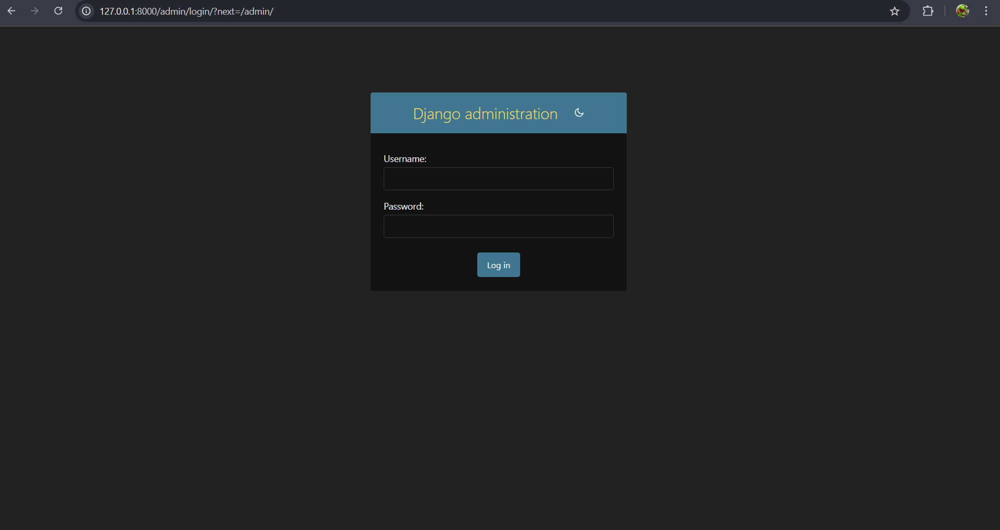
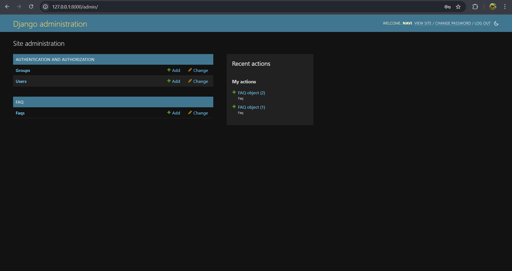
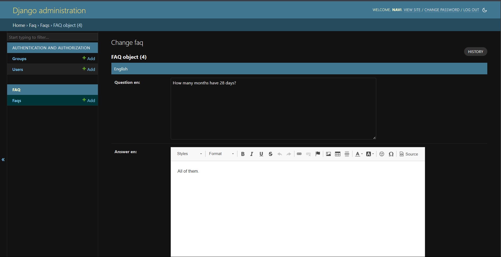
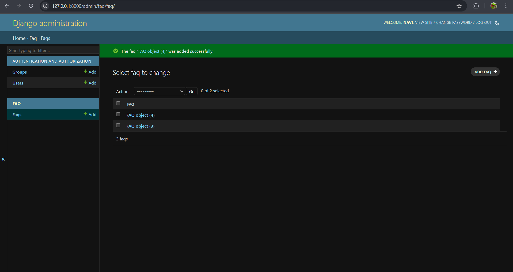
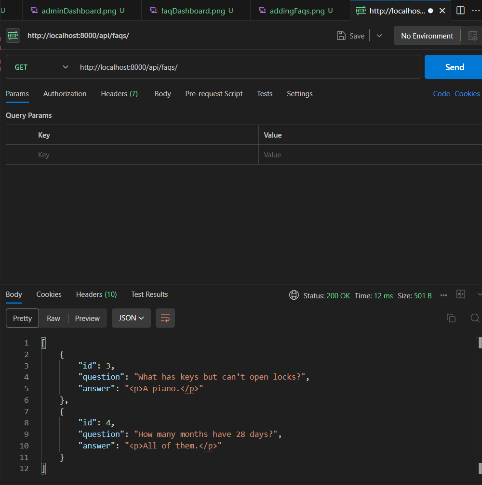
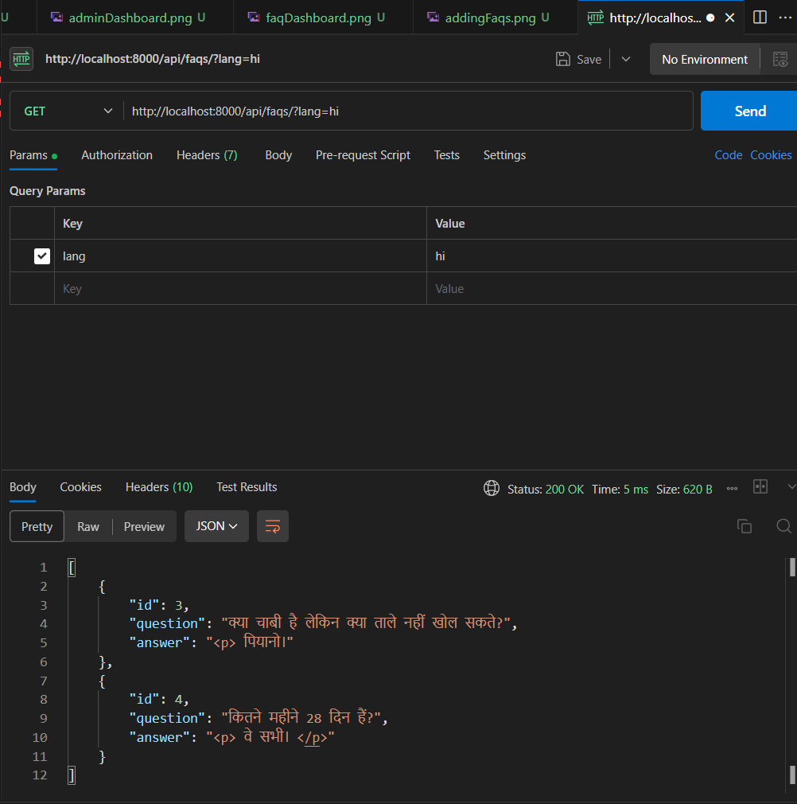
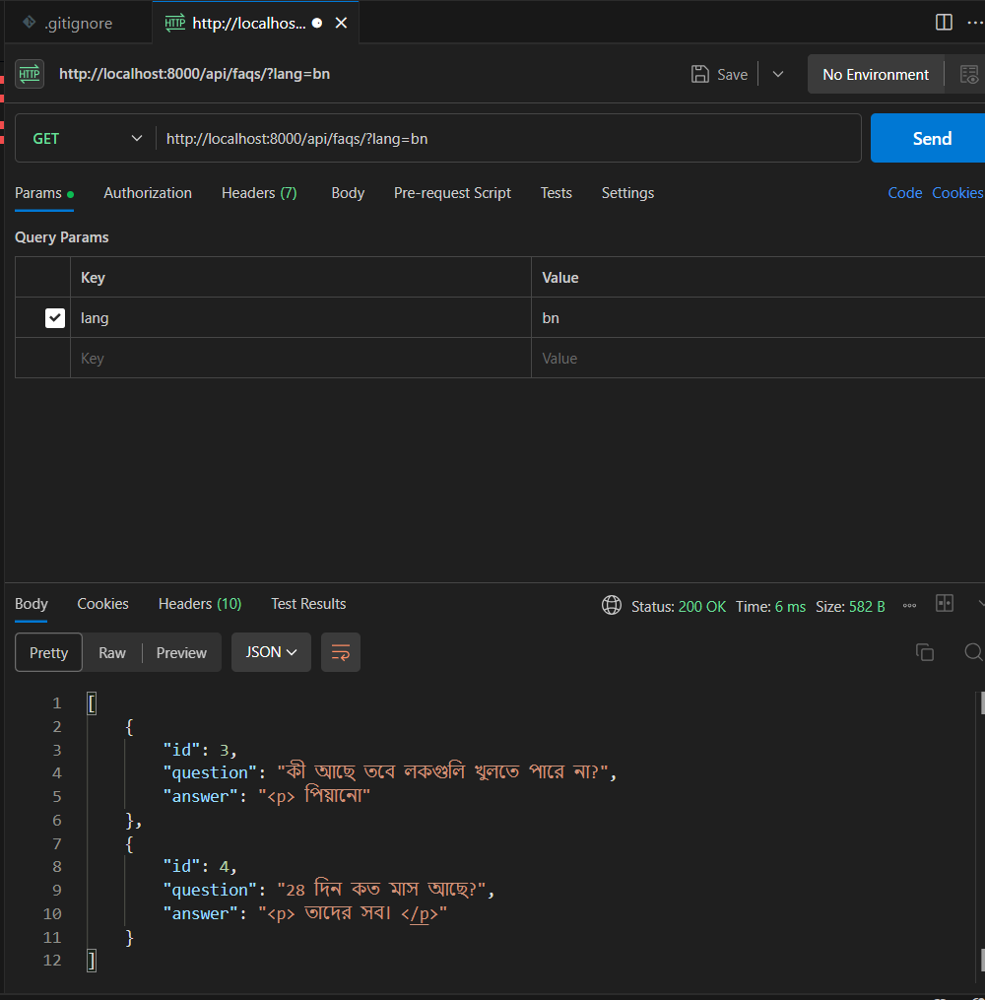

# FAQ Management System

## **Overview**
This project is a Django-based backend application designed to manage **Frequently Asked Questions (FAQs)** with multilingual support. The project includes the following key features:
- **FAQ Model** with multilingual translations for each question.
- **WYSIWYG editor integration** for rich text formatting of FAQ answers.
- **REST API** to fetch FAQs in different languages.
- **Caching Mechanism** using Redis for improved performance.
- **Automated Translation** using Google Translate API.
- **Admin Panel** for easy FAQ management.
- **Unit Tests** to ensure the functionality of models and API endpoints.
- **Documentation** to guide usage and contributions.

## **Technologies Used**
- Python 3.8+
- Django 3.2+
- django-ckeditor
- Redis
- Google Translate API (`googletrans` or similar)
- pytest (for unit tests)
- Docker (optional for deployment)

## **Features**
1. **Multilingual FAQ Model:**
   - Each FAQ has a question and answer, along with translations in different languages.
   - Languages supported by the application include English, Hindi, Bengali, and more.

2. **WYSIWYG Editor Support:**
   - `django-ckeditor` is integrated to allow rich text formatting for FAQ answers.
   
3. **API Endpoints:**
   - `GET /api/faqs/` – Fetch FAQs in the requested language (default is English).
   - Language selection can be done by passing a `lang` query parameter (`?lang=hi`, `?lang=bn`).
   
4. **Caching:**
   - Translations are cached in Redis for faster access.
   
5. **Translation Automation:**
   - FAQs are automatically translated using the Google Translate API.
   - In case a translation is unavailable, it falls back to the English version.

6. **Admin Panel:**
   - User-friendly admin interface for managing FAQs and translations.

7. **Unit Tests:**
   - Tests to verify model methods and API responses.

## **Installation**

### Prerequisites
- Python 3.8+
- Redis (for caching)
- Docker (optional)

### Setup

1. Clone the repository:
   ```bash
   git clone https://github.com/yourusername/faq-management.git
   cd faq-management
   ```

2. Install dependencies:
   ```bash
   pip install -r requirements.txt
   ```

3. Set up the database (SQLite is used by default):
   ```bash
   python manage.py migrate
   ```

4. Create a superuser for the admin panel:
   ```bash
   python manage.py createsuperuser
   ```

5. Start the development server:
   ```bash
   python manage.py runserver
   ```

6. Optionally, run Redis:
   If you have Redis installed locally, start the server:
   ```bash
   redis-server
   ```

## **API Usage**

### Fetch FAQs

To fetch FAQs in the default language (English):
```bash
curl http://localhost:8000/api/faqs/
```

To fetch FAQs in Hindi:
```bash
curl http://localhost:8000/api/faqs/?lang=hi
```

To fetch FAQs in Bengali:
```bash
curl http://localhost:8000/api/faqs/?lang=bn
```

## **Admin Panel**

To manage FAQs, visit the Django admin interface at:
```bash
http://localhost:8000/admin/
```
Use the credentials of the superuser created earlier.

relevant screenshots :









